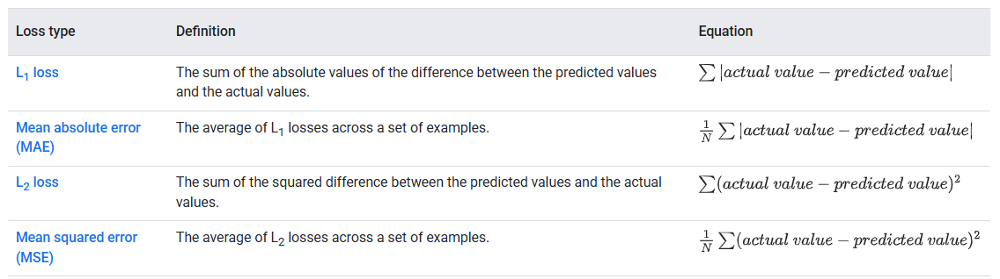
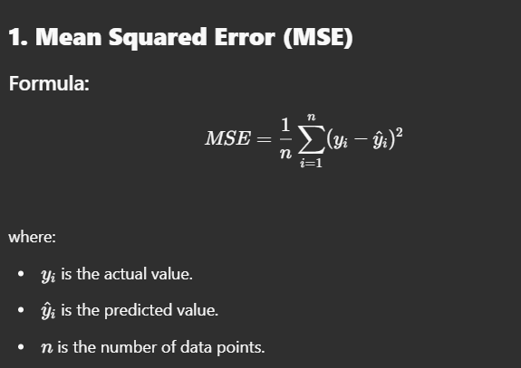
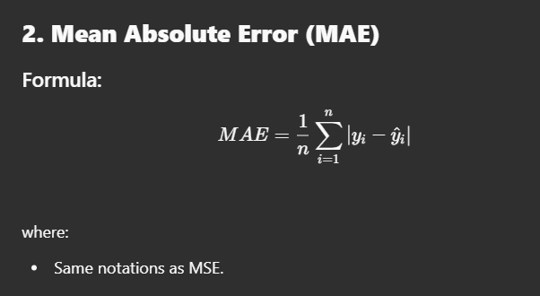
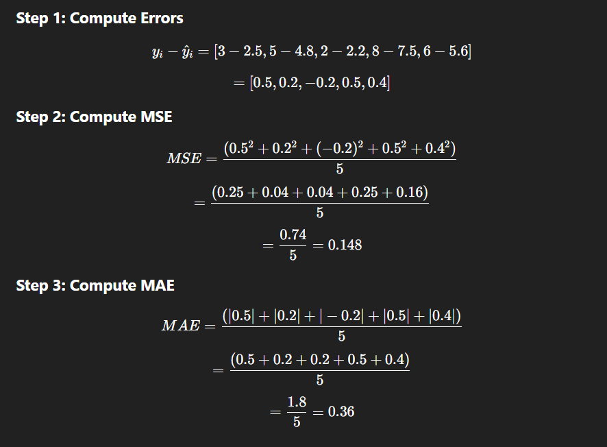
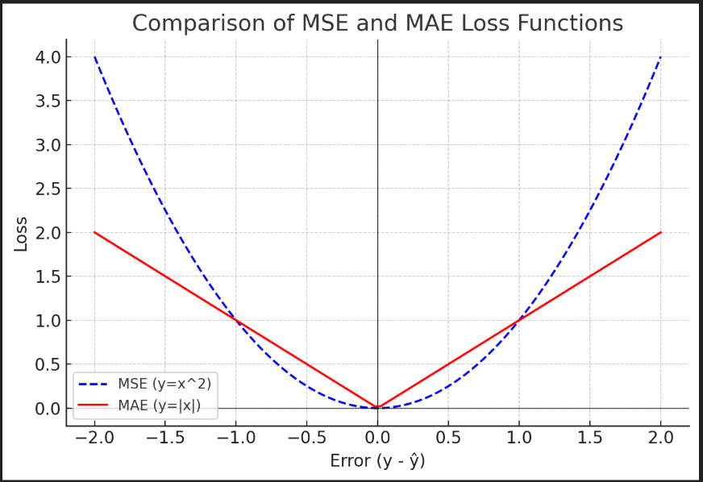
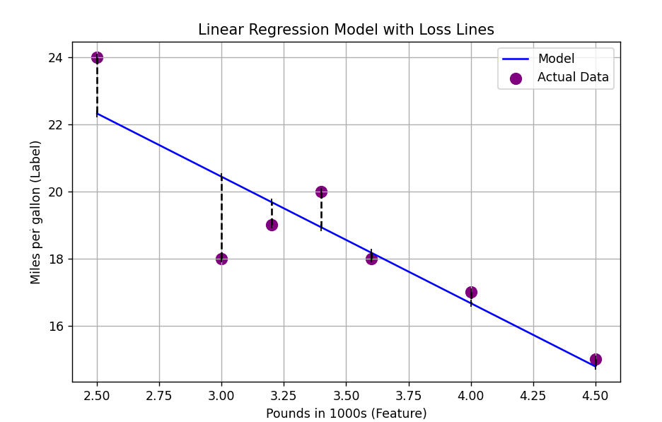
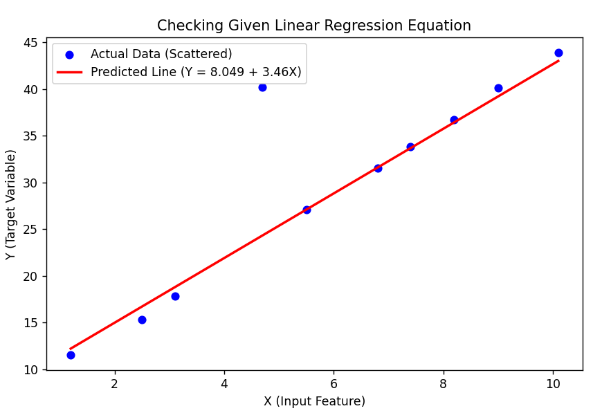

# **Linear Regression in Machine Learning**

Linear Regression is a fundamental supervised learning algorithm used for **predicting continuous values** based on given input features. It establishes a relationship between **independent variables (X)** and **dependent variable (Y)** using a straight-line equation:

\[
Y = mX + b
\]

where:
- \( Y \) = Predicted output (dependent variable)
- \( X \) = Input feature (independent variable)
- \( m \) = **Slope** (rate of change)
- \( b \) = **Bias (intercept)** (where the line crosses the Y-axis)

---

## **Graphical Representation**
  
  

---

## **Example of Linear Regression**
Imagine we are trying to predict a student's final exam score based on the number of hours they studied.

| **Hours Studied (X)** | **Exam Score (Y)** |
|--------------------|----------------|
| 1                | 50             |
| 2                | 55             |
| 3                | 65             |
| 4                | 70             |
| 5                | 75             |
| 6                | 85             |

Using **Linear Regression**, we find the best-fit line for this dataset.


### **Graph Explanation**
- **Blue dots** represent actual data points (Hours Studied vs. Exam Score).
- **Red dashed line** is the **Linear Regression line**, representing the predicted trend.

### **Prediction Example**
If a student studies for **5.5 hours**, the model predicts their exam score as:

\[
Y = mX + b
\]

Estimated score = **80**

---
---
---
---
---
---
## -- **Linear Regression Loss Functions**--
1. **Mean Squared Error (MSE)** → Measures variance in data  
2. **Mean Absolute Error (MAE)** → Measures standard deviation  



### **Key Differences**
- **L1 Loss (MAE):** Useful for detecting outliers.  
- **L2 Loss (MSE):** Helps determine if data has outliers.

---

## **Loss Function Graphs**
### **MSE Loss Function**
- MSE calculates squared differences between actual and predicted values.
- Squaring **penalizes larger errors** more significantly.
- The loss function is a **parabola**, where the lowest point is the best model fit.



### **MAE Loss Function**
- MAE calculates absolute differences between actual and predicted values.
- Unlike MSE, it treats all errors **equally**.
- It’s **more robust** to outliers than MSE.
- The loss function is a **V-shape**.



---

## **Step-by-Step Example**
Consider a dataset with actual and predicted values:

| Data Point | Actual (\( y_i \)) | Predicted (\( \hat{y}_i \)) |
|------------|----------------|----------------|
| 1          | 3              | 2.5            |
| 2          | 5              | 4.8            |
| 3          | 2              | 2.2            |
| 4          | 8              | 7.5            |
| 5          | 6              | 5.6            |

Graphical representation:



### **Comparison**
- **MSE (blue dashed line):** A parabola—larger errors contribute significantly.  
- **MAE (red line):** A V-shape—treats all errors linearly.  



The arrows show the **difference (error)** between actual and predicted values.

---
---
---
---
---
## **Python Code for Linear Regression**
```python
import numpy as np
import matplotlib.pyplot as plt

# Given equation: Y = 8.049 + 3.46 * X
b = 8.049  # Intercept
m = 3.46   # Slope

# Given data
X_values = np.array([1.2, 2.5, 3.1, 4.7, 5.5, 6.8, 7.4, 8.2, 9.0, 10.1])
Y_actual = np.array([11.5, 15.3, 17.8, 40.2, 27.1, 31.5, 33.8, 36.7, 40.1, 43.9])

# Calculate predicted Y using the given equation
Y_predicted = b + (m * X_values)

# Calculate error (MSE, MAE)
mse = np.mean((Y_actual - Y_predicted)**2)
mae = np.mean((Y_actual - Y_predicted))

# Plot the actual vs predicted values
plt.figure(figsize=(8, 5))
plt.scatter(X_values, Y_actual, color="blue", label="Actual Data (Scattered)")
plt.plot(X_values, Y_predicted, color="red", linewidth=2, label="Predicted Line (Y = 8.049 + 3.46X)")
plt.xlabel("X (Input Feature)")
plt.ylabel("Y (Target Variable)")
plt.title("Checking Given Linear Regression Equation")
plt.legend()
plt.show()

```

### Output : 
 

## Linear Regression Error Analysis  

### Mean Squared Error (MSE) and Mean Absolute Error (MAE)  

- **MSE**: 25.76143140000001  
  - *(MSE is able to detect the presence of an outlier in the data)*  
- **MAE**: 1.5000000000000022  

### **Individual Errors**  

#### **Mean Squared Error (MSE) and Mean Absolute Error (MAE) Values**  

| Data Point | 1     | 2     | 3     | 4     | 5     | 6     | 7     | 8     | 9     | 10    |
|------------|-------|-------|-------|-------|-------|-------|-------|-------|-------|-------|
| **MSE**    | 4.91  | 1.95  | 9.50  | 2.52  | 4.41  | 5.92  | 2.16  | 7.78  | 8.29  | 8.19  |
| **MAE**    | -0.701 | -1.399 | -0.975 | **15.889** *(Outlier)* | 0.021 | -0.077 | 0.147 | 0.279 | 0.911 | 0.905 |

### **Key Observations**
- The **high MSE** indicates the presence of an **outlier** (**data point 4** in MAE values).  
- **MSE is more sensitive to outliers** since it squares the error values, making large deviations more noticeable.  
- **MAE is less sensitive to outliers**, as it only takes the absolute difference.  


---