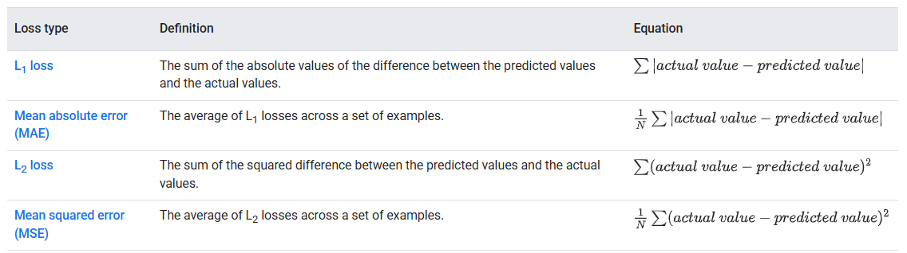
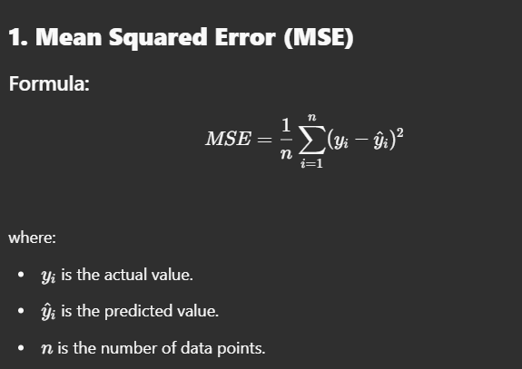
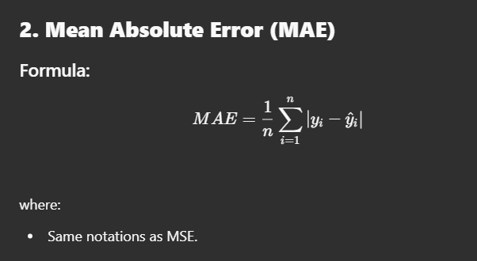
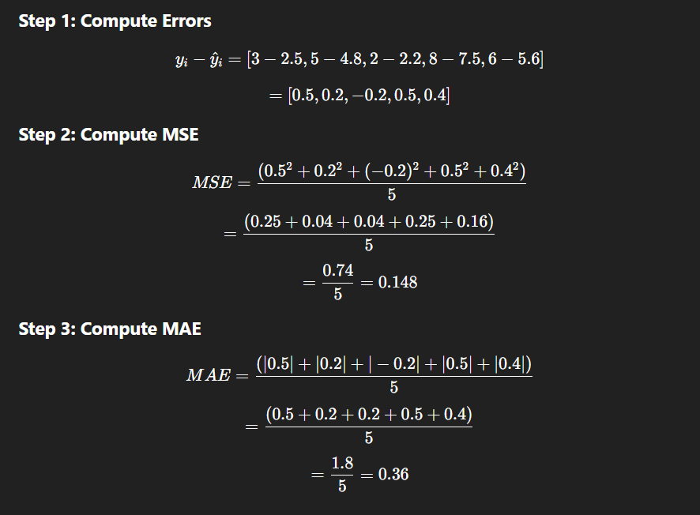
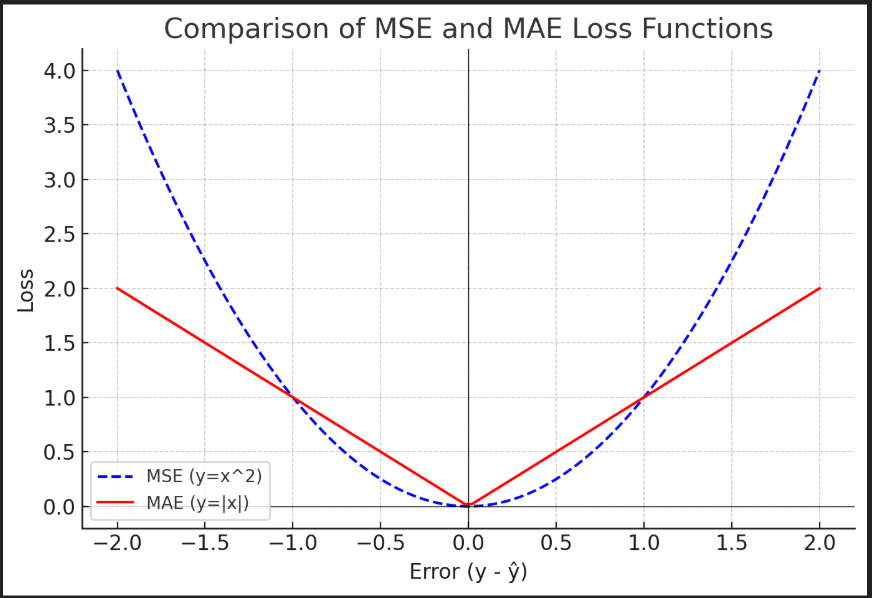
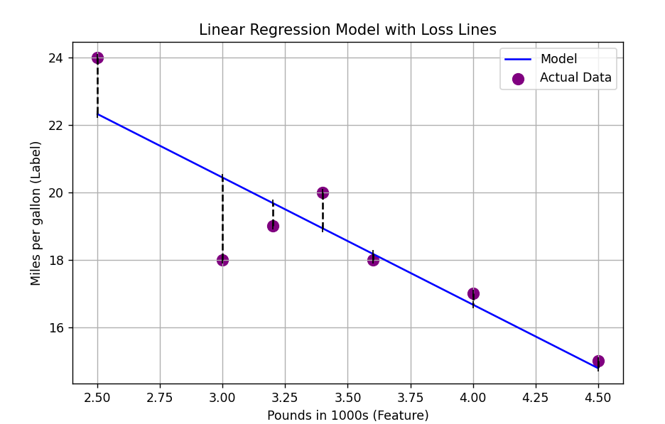

Linear regression loss functions measure how well a regression model fits the data. The two most common loss functions used in linear regression are:  

1. **Mean Squared Error (MSE)**  -> Variance 
2. **Mean Absolute Error (MAE)** -> Standard deviation 

- L1 loss - It can Find outliers in data.
- MSE - cheque if data have outliers 
---

### **Explanation**
- MSE calculates the squared differences between actual and predicted values.
- Squaring the errors penalizes larger errors more than smaller ones.
- It ensures non-negative values.

### **Graphical Representation**
- The loss function for MSE is a **parabola**.
- The minimum point of the parabola is the best-fit line.

---

### **Explanation**
- MAE takes the absolute differences between actual and predicted values.
- Unlike MSE, it treats all errors equally, without squaring.
- It’s more robust to outliers than MSE.

### **Graphical Representation**
- The loss function for MAE is a **V-shape**.
- The lowest point is where the best model parameters exist.

---

## **Step-by-Step Example**
Consider a dataset with actual and predicted values:

| Data Point | Actual (\( y_i \)) | Predicted (\( \hat{y}_i \)) |
|------------|----------------|----------------|
| 1          | 3              | 2.5            |
| 2          | 5              | 4.8            |
| 3          | 2              | 2.2            |
| 4          | 8              | 7.5            |
| 5          | 6              | 5.6            |

---

### **Comparison**
- **MSE** is smaller, meaning small errors are penalized more heavily.
- **MAE** is larger but gives equal weight to all errors.

I will generate a **graph** showing the loss functions visually.

The graph above shows:  

- **MSE (blue dashed line)**: A parabola, meaning larger errors contribute significantly to the loss.  
- **MAE (red line)**: A V-shape, treating all errors linearly without exaggerating large ones.  

The arrows show how far the model's predictions are from the actual values.

- L1 and L2 Calculate that line