✅ **What is Machine Learning (ML)?**  
Machine Learning is a branch of **Artificial Intelligence (AI)** that enables machines to **learn from data** and make **predictions** or **decisions** without being explicitly programmed. It allows systems to **improve their performance over time** by identifying patterns in the data.  

---

📊 **Types of Machine Learning Systems**  
Machine learning systems are classified into **five primary types** based on **how they learn** and the **type of data** they process:

### 1️⃣ **Supervised Learning**  
- **Learning Process:** AI learns from **labeled data** (data with correct answers).  
- **Goal:** Predict outcomes based on learned patterns.  
- **Example:** Spam email detection, where emails are labeled as "spam" or "not spam."  

### 2️⃣ **Unsupervised Learning**  
- **Learning Process:** AI learns from **unlabeled data** (without predefined outcomes).  
- **Goal:** Identify **hidden patterns** or groupings in the data.  
- **Example:** Customer segmentation in marketing.  

### 3️⃣ **Reinforcement Learning (RL)**  
- **Learning Process:** AI interacts with an **environment**, receiving **rewards** or **penalties** for actions.  
- **Goal:** Optimize decisions over time using advanced algorithms.  
- **Example:** Teaching a robot to navigate a maze.  

### 4️⃣ **Semi-Supervised Learning**  
- **Learning Process:** Combines **supervised** and **unsupervised** learning. AI learns from a **small amount of labeled** data and a **larger amount of unlabeled** data.  
- **Goal:** Improve learning efficiency with fewer labeled examples.  
- **Example:** Image recognition with a limited set of labeled images.  

### 5️⃣ **Generative AI**  
- **Learning Process:** AI **learns patterns** from existing data and **generates new content** that resembles the original data.  
- **Goal:** Create **new data** (such as text, images, audio, or videos) based on learned patterns.  
- **Example:**  
   - **Text:** Chatbots generating human-like conversations.  
   - **Images:** AI-generated artwork.  
   - **Audio:** Voice cloning.  

---

### **Related algorithms**

```mermaid
flowchart LR
    ML["Machine Learning"] -- Supervised Learning --> SUP["Supervised Learning 📊"]
    ML -- Unsupervised Learning --> UNSUP["Unsupervised Learning 🔍"]
    ML -- Reinforcement Learning --> RL["Reinforcement Learning 🎮"]
    SUP -- Regression --> REG["Linear Regression 📈"]
    SUP -- Classification --> DT["Decision Tree 🌳"] & SVM["Support Vector Machine ⚖️"] & RF["Random Forest 🌲"]
    SUP -- Deep Learning --> NN["Neural Networks 🧠"]
    UNSUP -- Clustering --> KM["K-Means 🏷️"] & DBSCAN["DBSCAN 🔬"]
    UNSUP -- Dimensionality Reduction --> PCA["Principal Component Analysis 📉"] & TSNE["t-SNE 🎭"]
    RL -- "Value-Based" --> QL["Q-Learning 🎲"]
    RL -- "Policy-Based" --> PG["Policy Gradient 🎯"]
    RL -- Hybrid --> AC["Actor-Critic 🔄"]
    REG -- "🔢 y = β₀ + β₁x₁ + ... + βₙxₙ\n📌 Predicts continuous values (e.g., house prices)" --- Formula1["Linear Regression"]
    DT -- "🔢 Gini Index = 1 - Σpᵢ²\n📌 Splits data based on features for classification" --- Formula2["Decision Tree"]
    SVM -- "🔢 f(x) = w·x + b\n📌 Finds optimal decision boundary for classification" --- Formula3["SVM"]
    RF -- "🔢 Final Prediction = Avg(Predictions from n Trees)\n📌 Uses multiple trees to improve accuracy" --- Formula4["Random Forest"]
    NN -- "🔢 ŷ = σ(WX + b)\n📌 Mimics the human brain for deep learning" --- Formula5["Neural Networks"]
    KM -- "🔢 J = Σ||xᵢ - cⱼ||²\n📌 Groups similar data points" --- Formula6["K-Means"]
    DBSCAN -- "📌 Identifies clusters using density-based approach" --- Formula7["DBSCAN"]
    PCA -- "🔢 Z = XW (Eigenvectors Projection)\n📌 Reduces dimensions while keeping essential features" --- Formula8["PCA"]
    TSNE -- "📌 Visualizes high-dimensional data in 2D/3D" --- Formula9["t-SNE"]
    QL -- "🔢 Q(s, a) = Q(s, a) + α[R + γ max(Q(s', a')) - Q(s, a)]\n📌 Learns through rewards & penalties" --- Formula10["Q-Learning"]
    PG -- "🔢 ∇J(θ) = E[∇ log π(a|s) * R]\n📌 Directly optimizes policy for actions" --- Formula11["Policy Gradient"]
    AC -- "📌 Combines Q-Learning & Policy Gradient for stability" --- Formula12["Actor-Critic"]
```

